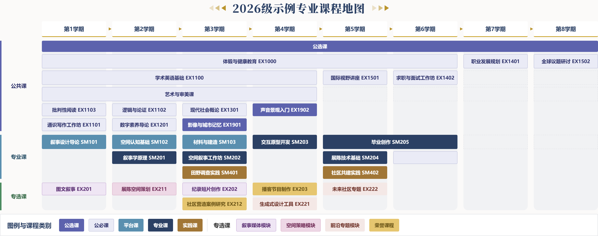

# SYSU 课程地图

把教务系统导出的课程 JSON 渲染成课程地图海报网页，一键导出 PNG。仓库不含任何真实课程数据。


## 快速开始

```bash
npm install
npm run dev        # http://localhost:5173
npm run build      # 产物在 dist/
```

顶栏功能：

- **地图切换**：清单来自 `data/maps/index.json`，也可用 `http://localhost:5173/?map=<id>` 直达
- **模板一 / 模板二**：即时切换主题并按地图记忆（localStorage，优先于 config）。模板1 = 玫红系圆角卡片，模板2 = 蓝金系直角衬线 
- **导入**：选择本地 JSON 即渲染；dev 下会真正保存——JSON 写入 `data/raw/`、自动生成 config（已存在则保留）、登记进 index.json，刷新不丢；`vite preview` / `file://` 下退化为会话内导入
- **导出图片**：下载 PNG

## 添加自己的地图

web导入或者手动导入
1. 把导出 JSON 放进 `data/raw/`（如 `data/raw/xxx.json`）
2. 在 `data/maps/index.json` 加一条：
   ```json
   { "id": "xxx", "title": "XXX课程地图", "data": "/raw/xxx.json", "config": "/maps/xxx.config.json" }
   ```
3. （可选）写 `data/maps/xxx.config.json`——没有 config 也能出图。

## 数据格式

JSON 形如 `{ code, data: { rows } }`（`{rows}` 或纯数组均可）。每行有用字段：

| 字段 | 说明 |
|---|---|
| `courseName` / `courseNumber` | 课程名（渲染名以它为准）/ 课程代码 |
| `courseCategoryName` | 公必 / 公选 / 专必 / 专选 |
| `courseSubClassModuleName` | 子模块名，可缺失（缺失时用 `courseTypeName` 兜底） |
| `courseTypeName` | 公共课 / 平台课程 / 专业课 / 实践课 / 专业选修课 |
| `initiationSemesterAnnotation` | 学期注记 `2026-1`…`2029-2`；`A~B` 表示 A 到 B 每个学期都出现 |


## config 全字段

| 字段 | 说明 |
|---|---|
| `title` | 海报标题，支持 `{year}` 占位 |
| `theme` | `template1`（默认结构）或 `template2`（直角+衬线标题+底部图例） |
| `legend` | `side`（右侧竖排，默认）或 `bottom`（底部横排） |
| `honor` | 荣誉课程代码数组，底色用荣誉色覆盖 |
| `moduleOrder` | 子模块名数组，固定「子模块→色槽」顺序；缺省按数据首现顺序 |
| `relocate` | `[{ code, semesters?, band? }]` 覆盖学期归位与所在带（semesters 为学期序号数组） |
| `extraCourses` | `[{ semesters:'all'\|[序号], band, key, name, code?, type, placeholder? }]` 补充数据里没有的占位/课程 |
| `emptySlots` | `[{ semester, band, style? }]` 空占位盒（band 取合并前编号 1-4） |
| `order` | `{ '学期-带': [key,...] }` 显式排序；带取合并前编号（1 公共 / 2 专业 / 3 实践 / 4 专选），未列出的按 JSON 行序 |
| `paletteSeed` | 数字；固定随机配色种子（缺省每次加载在固定基调 ±12° 内微随机） |


